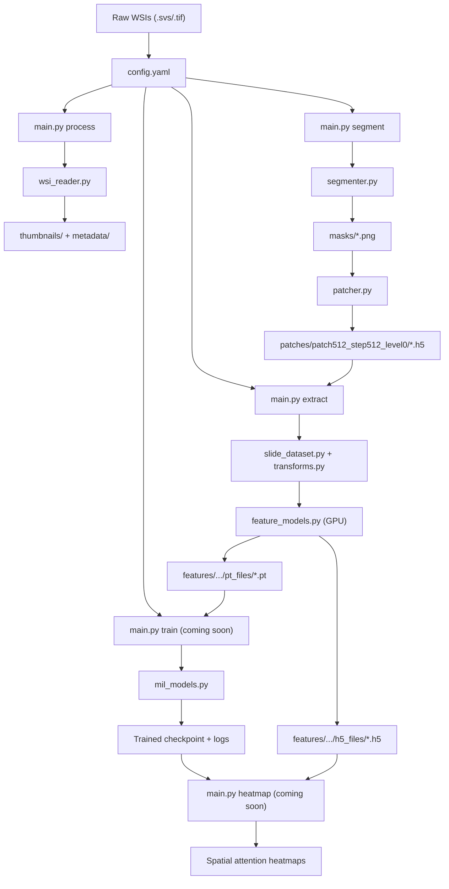

# WSI Framework Architecture

The framework is modular, experiment-friendly, and entirely configurable via a single YAML file.

---

## 1. Project Directory Structure

```text
wsi_framework/
├── config/
│   └── config.yaml             # Single source of truth for all pipeline parameters
├── core/                       # Low-level building blocks
│   ├── wsi_reader.py           # OpenSlide wrapper: metadata, thumbnails, patch reading
│   ├── segmenter.py            # Tissue detection: HSV masking + Otsu + morphology
│   └── patcher.py              # Patch coordinate extraction → .h5 files
├── datasets/
│   └── slide_dataset.py        # PyTorch Dataset: streams patches from WSI via HDF5 coords
├── models/
│   ├── feature_models.py       # Backbone factory: lazy-load RN50, UNI, Virchow, Phikon…
│   └── mil_models.py           # (coming soon) ABMIL, CLAM, TransMIL
├── pipelines/                  # High-level orchestrators (one per CLI command)
│   ├── preprocess.py           # segment command: runs segmenter + patcher
│   ├── extract.py              # extract command: GPU feature extraction → .pt + .h5
│   ├── debug.py                # debug-segmentation / extract-tile commands
│   ├── train.py                # (coming soon)
│   ├── evaluate.py             # (coming soon)
│   └── visualize.py            # (coming soon)
├── utils/
│   ├── config.py               # YAML loader, validator, directory initialiser
│   ├── transforms.py           # Named transform registry (reinhard, macenko, uni_default…)
│   ├── logger.py               # Structured rotating file + console logger
│   └── metrics.py              # (coming soon) AUC, F1, accuracy helpers
├── docs/
│   ├── setup_and_usage.md
│   └── architecture.md         # This file
├── main.py                     # Unified CLI entry point
└── requirements.txt
```

---

## 2. Module Responsibilities

| Module | Responsibility |
|---|---|
| `core/wsi_reader.py` | High-level OpenSlide interface. Multi-resolution reading, metadata extraction, thumbnail generation. |
| `core/segmenter.py` | Tissue mask generation: HSV colour-space masking, median blur, Otsu threshold, morphological closing. |
| `core/patcher.py` | Enumerates valid patch positions inside tissue contours. Saves `(x, y)` coordinates and metadata to `.h5`. |
| `datasets/slide_dataset.py` | PyTorch `Dataset` wrapping an openslide handle and `.h5` coords. The slide is opened in the **main process** (`num_workers=0`) to avoid Windows pickling errors with ctypes. |
| `models/feature_models.py` | `load_backbone(model_type)` → `(model, feat_dim, input_size)`. All imports are lazy. `pool_features()` handles model-specific output heads (Phikon, Virchow, Hibou). |
| `utils/transforms.py` | Named preprocessing registry. Stain normalisation (reinhard/macenko) uses `ToTensor → ×255 → NormClass()` to match torchstain's expected input range. |
| `pipelines/extract.py` | Sequential per-slide GPU loop. Opens slide in main thread, builds DataLoader, runs model, saves `.pt` tensor and `.h5` (features + coords) per slide. |

---

## 3. Pipeline Workflow



---

## 4. CLI Command Reference

| Command | Description |
|---|---|
| `python main.py stats` | Dataset scan → `results/dataset_stats.csv` |
| `python main.py process` | Thumbnails + JSON metadata per slide |
| `python main.py segment` | Tissue segmentation + patch coordinate `.h5` files |
| `python main.py debug-segmentation` | Tile overlay on WSI thumbnail | 
| `python main.py extract-tile` | Single high-res tile extraction for visual QC |
| `python main.py extract` | GPU feature extraction → `.pt` + `.h5` per slide |
| `python main.py train` | *(coming soon)* MIL training |
| `python main.py evaluate` | *(coming soon)* Evaluation and metrics |
| `python main.py heatmap` | *(coming soon)* Attention heatmap generation |

---

## 5. Results Directory Structure

All outputs are routed under `results/`, with directory names encoding pipeline parameters to prevent accidental overwrites across different experiments:

```text
results/
├── thumbnails/                         # WSI thumbnail PNGs
├── metadata/                           # Slide metadata JSONs
├── masks/                              # Binary tissue masks
├── patches/
│   └── patch512_step512_level0/        # Folder = patch size + step + pyramid level
│       └── <slide>.h5                  # coords (N,2) + patch_level + patch_size attrs
├── features/
│   └── patch512_step512_level0__rn50/  # Folder = patch config + model name
│       ├── pt_files/
│       │   └── <slide>.pt              # FloatTensor (N, D)
│       └── h5_files/
│           └── <slide>.h5              # HDF5: 'features' (N,D) + 'coords' (N,2)
├── experiments/                        # (coming soon) MIL training artefacts
├── heatmaps/                           # (coming soon) Spatial attention visualisations
├── debug/                              # Debug tile + segmentation overlay images
└── wsi_framework.log                   # Rotating log file
```

This structure guarantees that swapping `model: rn50` → `model: uni` generates a completely separate `features/` subdirectory with no risk of overwriting existing embeddings.
