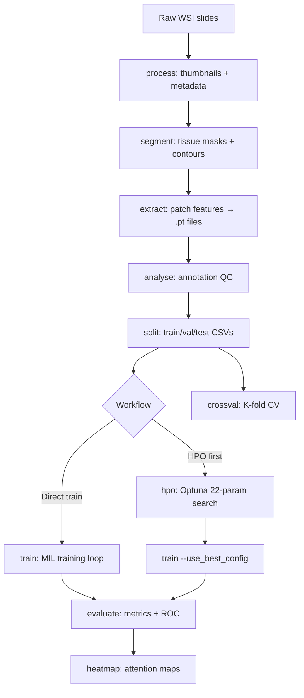
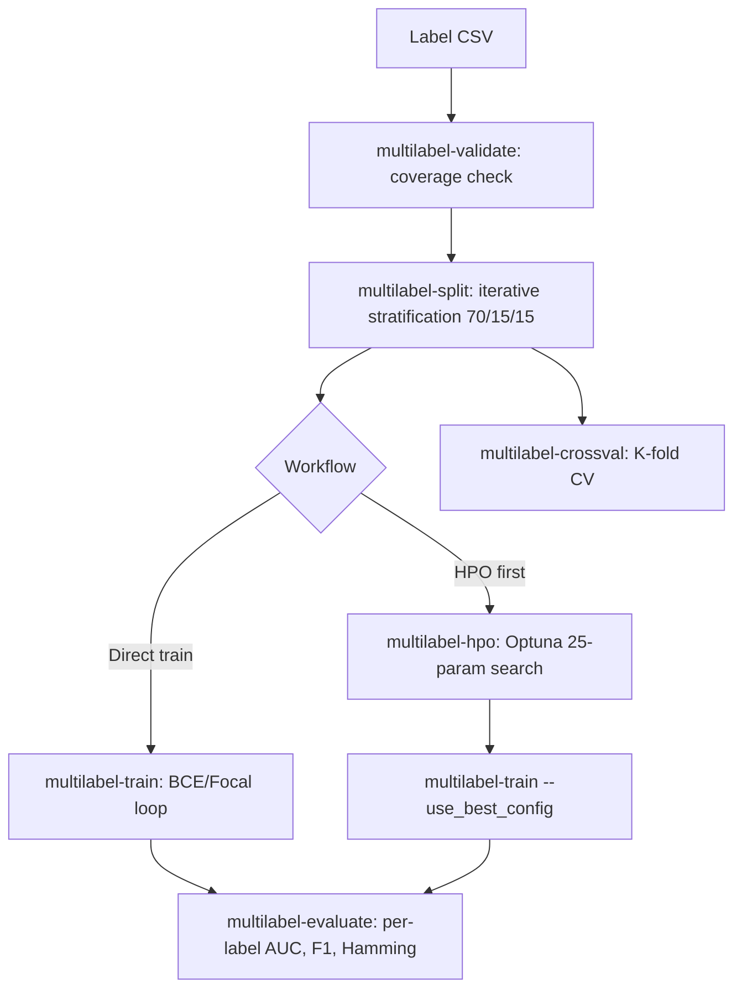

# WSI Framework — Architecture

## Directory Layout

```
wsi_framework/
├── main.py                        Entry-point: CLI parsing → command dispatch
├── config/
│   └── config.yaml                Single source of truth for all pipeline parameters
│
├── core/
│   ├── wsi_reader.py              Slide open / tile read (OpenSlide-backed)
│   ├── segmenter.py               Tissue segmentation + contour filtering
│   ├── tiler.py                   Patch coordinate generation → .h5
│   └── feature_extractor.py       Multi-GPU patch embedding → .pt + .h5
│
├── models/
│   ├── mil_models.py              Single-label MIL models + build_mil_model()
│   └── mil_multilabel_models.py   Multi-label variants + build_multilabel_model()
│
├── datasets/
│   ├── mil_dataset.py             MILBagDataset (single-label)
│   └── mil_multilabel_dataset.py  MultiLabelMILDataset
│
├── pipelines/
│   ├── analyse_annotations.py     Class-distribution analysis
│   ├── split.py                   Stratified train/val/test CSV splits
│   ├── train.py                   MIL training loop
│   ├── evaluate.py                Test-set metrics + ROC + confusion matrix
│   ├── heatmap.py                 Attention heatmap visualisation
│   ├── hpo.py                     Optuna HPO — single-label
│   ├── crossval.py                K-fold cross-validation — single-label
│   ├── multilabel_split.py        Iterative-stratified CV splits
│   ├── multilabel_train.py        Multi-label MIL training loop
│   ├── multilabel_evaluate.py     Multi-label metrics + per-label report
│   ├── multilabel_hpo.py          Optuna HPO — multi-label
│   └── multilabel_crossval.py     K-fold CV — multi-label
│
├── utils/
│   ├── config_utils.py            YAML loading, key validation, deep merge
│   ├── logger.py                  Shared logging setup
│   └── transforms.py              Stain-norm / ViT preprocessing transforms
│
└── docs/
    ├── architecture.md            This file
    └── setup_and_usage.md         Installation and full command guide
```

---

## Module Responsibilities

| Module | Responsibility |
|---|---|
| `main.py` | CLI routing: each sub-command maps to exactly one pipeline function |
| `config/config.yaml` | Canonical parameter store — read-only at runtime, snapshots saved per run |
| `core/wsi_reader.py` | Slide IO: open WSI, get level dims, read region at arbitrary level |
| `core/segmenter.py` | HSV + Otsu threshold → morphological mask → tissue & hole contours |
| `core/tiler.py` | Contour-based patch coord generation, blank-patch filtering, `.h5` save |
| `core/feature_extractor.py` | Multi-process multi-GPU inference, AMP, DataLoader prefetch, `.pt` save |
| `models/mil_models.py` | All 7 MIL architectures + `build_mil_model()` factory |
| `models/mil_multilabel_models.py` | Multi-label wrappers (sigmoid head, n_labels output) |
| `datasets/mil_dataset.py` | `MILBagDataset`: loads `.pt` bag, enforces `max_patches` (A_patches) |
| `datasets/mil_multilabel_dataset.py` | Multi-label bag dataset + `label_pos_weights()` |
| `pipelines/split.py` | Stratified splits → `results/splits/<task>/train|val|test.csv` |
| `pipelines/train.py` | Full training loop: warmup, scheduler, early stopping, checkpoints, plots |
| `pipelines/hpo.py` | Optuna study: 22-parameter search, per-run directories, best_config merge |
| `pipelines/crossval.py` | K-fold CV with structured tracking under `results/crossval/` |
| `pipelines/multilabel_split.py` | `skmultilearn` iterative stratification, 70/15/15 default |
| `pipelines/multilabel_train.py` | BCE/Focal loss, per-label pos_weight, multi-label metrics |
| `pipelines/multilabel_hpo.py` | 25-parameter multi-label Optuna study |
| `pipelines/multilabel_crossval.py` | Multi-label K-fold CV with tracking |
| `utils/config_utils.py` | YAML load, deep merge for HPO best_config, required-key validation |

---

## MIL Model Dimension Invariant

All models enforce a strict **`encoding_size` → `proj_dim`** separation:

```
Raw patch features (N, encoding_size)
        │
        ▼  self.proj = Linear(encoding_size, proj_dim)
Projected features (N, proj_dim)
        │
        ▼  All downstream layers use proj_dim exclusively:
           • Attention modules (hidden_dim is internal to attention)
           • Bag classifiers
           • Instance classifiers (CLAM)
```

**Key rule:** `encoding_size` is **never** changed by HPO. Only `proj_dim` (tuned via `feature_proj_dim` search param) is varied. This guarantees that instance classifiers and bag aggregation always see the same dimensionality, preventing the shape-mismatch error that occurs when HPO varies projection sizes.

| Config Key | Meaning | Changed by HPO? |
|---|---|---|
| `mil.encoding_size` | Actual `.pt` feature dimension | ❌ Never |
| `mil.proj_dim` | Internal projection (attn, clf, inst_clf) | ✅ via `feature_proj_dim` |
| `mil.hidden_dim` | Attention network internal width | ✅ via `attn_hidden_dim` |

---

## Pipeline Workflows

### Single-Label Pipeline



### Multi-Label Pipeline



---

## Experiment Tracking

### HPO Output Structure

Each HPO run is **totally isolated** by a run ID encoding the study name, feature directory, and timestamp:

```
results/hpo/
    mil_hpo__patch512_step512_level0__optimus__TUM__20260402_063229/
    │
    ├── experiment_info.json     ← study name, feature dir, metric, n_trials, device, timestamp
    ├── base_config.yaml         ← exact config.yaml snapshot at run start
    ├── trial_0000/
    │   ├── trial_config.yaml    ← merged config for this trial
    │   └── trial_metrics.json   ← per-epoch val metrics
    ├── ...
    ├── best_config.yaml         ← merged config with best hyperparameters
    ├── best_trial.json          ← best trial: params + val metric
    ├── hpo_results.csv          ← all trials summary (sortable)
    └── study.db                 ← Optuna SQLite (resumable)
```

### Cross-Validation Output Structure

CV runs encode `task → model → features → timestamp`, making every run uniquely identifiable:

```
results/crossval/<task_name>/<model>__<feat_dir>__<YYYYMMDD_HHMMSS>/
│
├── experiment_info.json    ← task, model, feature_dir, n_folds, seed, timestamp
├── config_snapshot.yaml    ← exact config.yaml used
├── combined_pool.csv       ← merged train+val pool (all available labelled slides)
├── fold_01/
│   ├── best_model.pt
│   └── fold_metrics.json
├── fold_02/ ... fold_N/
├── cv_summary.json         ← mean ± std per metric across folds
└── cv_summary.csv
```

Multi-label CV outputs to: `results/multilabel/crossval/<task>/<model>__<feat_dir>__<ts>/`

---

## Loss Functions

### Single-Label
- `CrossEntropyLoss` — with optional label smoothing and class-weight balancing

### Multi-Label
- `BCEWithLogitsLoss` — per-label, with optional `pos_weight = neg/pos` balancing
- `FocalLoss` — `FL(p) = −α(1−p)^γ · log(p)` — reduces easy-example contributions

---

## HPO Search Space Summary

### Single-Label (22 parameters)

| Group | Parameters |
|---|---|
| Model | `model`, `feature_proj_dim`, `attn_hidden_dim`, `dropout`, `dropout_attn`, `dropout_classifier` |
| Optimizer | `optimizer`, `learning_rate`, `weight_decay`, `beta1`, `beta2`, `eps` |
| Scheduler | `lr_scheduler`, `lr_factor`, `lr_patience` |
| Regularisation | `label_smoothing`, `patch_dropout`, `max_patches` (A_patches: 600–1200) |
| Training | `warmup_epochs`, `early_stop_patience` |

### Multi-Label (25 parameters)

All single-label parameters plus: `loss`, `focal_gamma`, `threshold`, `patch_shuffle`.

---

## Results Directory Layout

```
results/
├── features/
│   └── patch512_step512_level0__optimus__TUM/
│       ├── pt_files/*.pt
│       └── h5_files/*.h5
│
├── splits/<task_name>/
│   ├── train.csv
│   ├── val.csv
│   └── test.csv
│
├── experiments/<task_name>/<model>_<timestamp>/
│   ├── best_model.pt
│   ├── final_model.pt
│   ├── train_history.csv
│   ├── config_snapshot.yaml
│   └── plots/
│
├── hpo/<run_id>/
│   ├── experiment_info.json
│   ├── best_config.yaml
│   ├── hpo_results.csv
│   └── study.db
│
├── crossval/<task>/<model>__<feat_dir>__<ts>/
│   ├── experiment_info.json
│   ├── fold_*/
│   └── cv_summary.json
│
└── multilabel/
    ├── experiments/<task>/<model>_<ts>/
    ├── hpo/<run_id>/
    └── crossval/<task>/<model>__<feat_dir>__<ts>/
```
