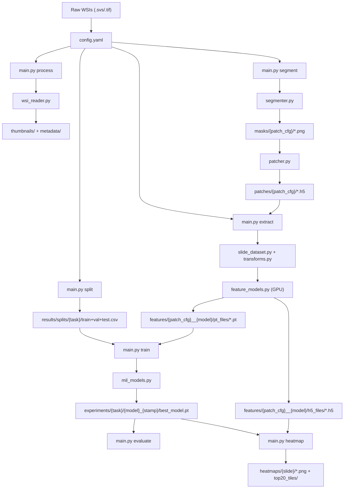

# WSI Framework Architecture

The framework is modular, experiment-friendly, and entirely configurable via a single YAML file.

---

## 1. Project Directory Structure

```text
wsi_framework/
├── config/
│   └── config.yaml             # Single source of truth for all pipeline parameters
├── core/                       # Low-level building blocks
│   ├── wsi_reader.py           # OpenSlide wrapper: metadata, thumbnails, patch reading
│   ├── segmenter.py            # Tissue detection: HSV masking + Otsu + morphology
│   └── patcher.py              # Patch coordinate extraction → .h5 files
├── datasets/
│   ├── slide_dataset.py        # PyTorch Dataset: streams patches from WSI via HDF5 coords
│   └── mil_dataset.py          # MIL Bag Dataset: loads .pt feature tensors + labels
├── models/
│   ├── feature_models.py       # Backbone factory: lazy-load RN50, UNI, Virchow, Phikon…
│   └── mil_models.py           # MIL models: ABMIL, CLAM-SB/MB, TransMIL, DSMIL, pool
├── pipelines/                  # High-level orchestrators (one per CLI command)
│   ├── preprocess.py           # segment: tissue segmenter + patcher
│   ├── extract.py              # extract: GPU feature extraction → .pt + .h5
│   ├── debug.py                # debug-segmentation, extract-tile: visual QC
│   ├── analyse_annotations.py  # analyse: annotation CSV validation + class report
│   ├── split.py                # split: train/val/test CSV generation
│   ├── train.py                # train: MIL training loop + checkpointing + plots
│   ├── evaluate.py             # evaluate: metrics, ROC curves, confusion matrix
│   ├── visualize.py            # heatmap: attention heatmap overlay + top-tile extraction
│   ├── classify.py             # classify: batched GPU patch inference + features filtering
│   └── classify_heatmap.py     # classify-heatmap: categorical/confidence prediction heatmaps
├── utils/
│   ├── config.py               # YAML loader, validator, directory initialiser
│   ├── transforms.py           # Named transform registry (reinhard, macenko, uni_default…)
│   ├── logger.py               # Structured rotating file + console logger
│   └── metrics.py              # AUC, F1, accuracy helpers
├── docs/
│   ├── setup_and_usage.md
│   └── architecture.md         # This file
├── main.py                     # Unified CLI entry point
└── requirements.txt
```

---

## 2. Module Responsibilities

| Module | Responsibility |
|---|---|
| `core/wsi_reader.py` | High-level OpenSlide interface. Multi-resolution reading, metadata extraction, thumbnail generation. |
| `core/segmenter.py` | Tissue mask generation: HSV colour-space masking, median blur, Otsu threshold, morphological closing. Contour filtering by area. |
| `core/patcher.py` | Enumerates valid patch positions inside tissue contours. Saves `(x, y)` coordinates and metadata to `.h5`. Optionally filters blank/black patches. |
| `datasets/slide_dataset.py` | PyTorch `Dataset` wrapping an openslide handle and `.h5` coords. Opened in the **main process** (`num_workers=0`) to avoid Windows pickling errors with ctypes. |
| `datasets/mil_dataset.py` | `MILBagDataset`: loads pre-extracted `.pt` tensors as bags. `build_mil_datasets()` builds train/val/test splits from CSVs and resolves the correct feature directory via config or override. |
| `models/feature_models.py` | `load_backbone(model_type)` → `(model, feat_dim, input_size)`. All imports are lazy. `pool_features()` handles model-specific output heads (Phikon, Virchow, Hibou, DSMIL). |
| `models/mil_models.py` | `build_mil_model(config)` factory. Supports `mean_pool`, `max_pool`, `abmil`, `clam_sb`, `clam_mb`, `transmil`, `dsmil`. `has_attention()` gating for heatmap eligibility. |
| `utils/transforms.py` | Named preprocessing registry. Stain normalisation (reinhard/macenko) uses `ToTensor → ×255 → NormClass()` to match torchstain's expected input range. |
| `pipelines/preprocess.py` | Sequential/parallel per-slide loop: segment → patch coords → save `.h5`. Writes masks to `masks/{patch_config}/`. |
| `pipelines/extract.py` | Sequential per-slide GPU loop. Opens slide in main thread, builds DataLoader, runs model, saves `.pt` tensor and `.h5` (features + coords) per slide. |
| `pipelines/train.py` | MIL training loop: AdamW + ReduceLROnPlateau + early stopping. Saves `best_model.pt`, `final_model.pt`, `train_history.csv`, `config_snapshot.yaml`, and loss/AUC/LR curve PNGs. |
| `pipelines/evaluate.py` | Loads experiment checkpoint, runs inference on test set, outputs `predictions.csv`, `roc_data.csv`, `confusion_matrix.csv`, `metrics.json`, and `.png` figures. |
| `pipelines/visualize.py` | Generates per-slide attention heatmaps from stored `.h5` feature+coord files and model attention scores. Extracts top-20 highest-attention tiles. |
| `pipelines/classify.py` | Patch inference loop: Loads pretrained classifier and `.h5`/`.pt` features, generates per-WSI patch prediction CSVs, and saves filtered features per active category. |
| `pipelines/classify_heatmap.py` | Prediction visualizer: Reads `classify.py` CSVs and WSI thumbnails to render tile-level categorical maps or class-specific confidence heatmaps. Saves top-K patches. |

---

## 3. Pipeline Workflow



---

## 4. CLI Command Reference

| Command | Description |
|---|---|
| `python main.py stats` | Dataset scan → `results/dataset_stats.csv` |
| `python main.py process` | Thumbnails + JSON metadata per slide |
| `python main.py segment` | Tissue segmentation + patch coordinate `.h5` files |
| `python main.py debug-segmentation` | Tile overlay on WSI thumbnail |
| `python main.py extract-tile` | Single high-res tile extraction for visual QC |
| `python main.py extract` | GPU feature extraction → `.pt` + `.h5` per slide |
| `python main.py analyse` | Annotation CSV validation + class distribution report |
| `python main.py split` | Train/val/test CSV split generation |
| `python main.py train` | MIL model training with history + checkpointing |
| `python main.py evaluate` | Evaluation metrics, ROC curves, confusion matrix |
| `python main.py heatmap` | Attention heatmap overlay + top-20 tile extraction |

### Key CLI flags (all commands)

| Flag | Commands | Effect |
|---|---|---|
| `--config PATH` | all | Path to YAML config (default: `config/config.yaml`) |
| `--patches SUBFOLDER` | `segment`, `extract` | Override patch subfolder (highest priority) |
| `--features SUBFOLDER` | `extract`, `train`, `evaluate`, `heatmap` | Override feature base subfolder (model always appended) |
| `--experiment PATH` | `evaluate`, `heatmap` | Path to experiment dir (auto-detects latest if omitted) |
| `--csv PATH` | `analyse`, `split` | Path to annotation CSV |

---

## 5. Results Directory Structure

All outputs are routed under `results/`, with directory names encoding pipeline parameters to prevent accidental overwrites across different experiments.

```text
results/
├── dataset_stats.csv                   # Slide inventory
├── thumbnails/                         # WSI thumbnail PNGs
├── metadata/                           # Slide metadata JSONs
├── masks/
│   └── patch512_step512_level0/        # Masks mirror the patch config subfolder
│       └── <slide>_mask.png
├── patches/
│   └── patch512_step512_level0/        # Folder = patch_size + step_size + pyramid_level
│       └── <slide>.h5                  # coords (N,2) + patch_level + patch_size attrs
├── features/
│   └── patch512_step512_level0__rn50/  # Folder = patch_config + __ + model_name
│       ├── pt_files/
│       │   └── <slide>.pt              # FloatTensor (N, D)
│       └── h5_files/
│           └── <slide>.h5              # HDF5: 'features' (N,D) + 'coords' (N,2)
├── splits/
│   └── <task_name>/
│       ├── train.csv
│       ├── val.csv
│       ├── test.csv
│       └── split_summary.txt
├── experiments/
│   └── <task_name>/
│       └── <model>_<timestamp>/
│           ├── best_model.pt           # weights + optimizer + config + class_map + metrics
│           ├── final_model.pt
│           ├── train_history.csv       # loss, acc, auc, f1, lr, time per epoch
│           ├── config_snapshot.yaml    # exact YAML used for this run
│           ├── plots/
│           │   ├── train_loss_curve.png
│           │   ├── val_auc_curve.png
│           │   ├── val_acc_curve.png
│           │   └── learning_rate.png
│           ├── evaluate/
│           │   ├── predictions.csv
│           │   ├── roc_data.csv
│           │   ├── confusion_matrix.csv
│           │   ├── classification_report.txt
│           │   ├── metrics.json
│           │   ├── roc_curve.png
│           │   └── confusion_matrix.png
│           └── heatmaps/<slide_id>/
│               ├── <slide>_heatmap.png
│               ├── <slide>_attention_scores.csv
│               └── top20_tiles/
│                   └── 01_<slide>_x..._y..._a....png
├── debug/                              # Debug tile + segmentation overlay images
└── wsi_framework.log                   # Rotating log file (10 MB max)
```

> **Key guarantee:** swapping `model: rn50` → `model: uni` in `config.yaml` generates a completely separate `features/` subdirectory with no risk of overwriting existing embeddings. Similarly, changing `patch_size` or `step_size` creates a new `patches/` and `masks/` subdirectory.

---

## 6. Subfolder Naming & Override System

### Default Auto-naming

| Stage | Auto-derived subfolder name |
|---|---|
| `segment` (patches) | `patch{size}_step{step}_level{lvl}` |
| `segment` (masks) | `patch{size}_step{step}_level{lvl}` (same as patches) |
| `extract` (features) | `patch{size}_step{step}_level{lvl}__{model}` |

### Override Priority (highest → lowest)

1. **CLI flag** (`--patches` / `--features`)
2. **YAML key** (`tiling.patches_subfolder_override` / `feature_extraction.features_subfolder_override`)
3. **Auto-derived** name from config parameters

> For features: the override sets the **base name only**. The model key (e.g. `__rn50`) is **always** appended automatically, ensuring each `(base_name, model)` combination has its own directory.
