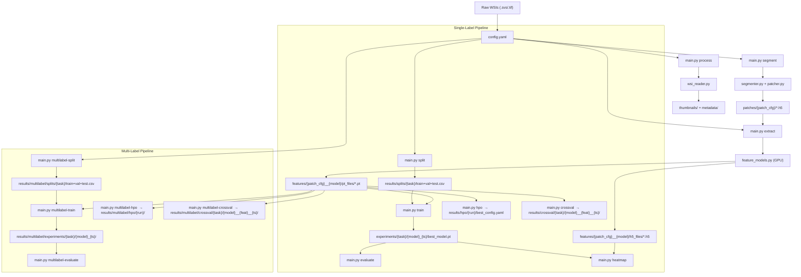

# WSI Framework Architecture

The framework is modular, experiment-friendly, and entirely configurable via a single YAML file. It supports two fully isolated classification pipelines sharing one preprocessing stack.

---

## 1. Project Directory Structure

```text
wsi_framework/
├── config/
│   └── config.yaml              # Single source of truth for all pipeline parameters
├── core/                        # Low-level building blocks
│   ├── wsi_reader.py            # OpenSlide wrapper: metadata, thumbnails, patch reading
│   ├── segmenter.py             # Tissue detection: HSV masking + Otsu + morphology
│   └── patcher.py               # Patch coordinate extraction → .h5 files
├── datasets/
│   ├── slide_dataset.py         # PyTorch Dataset: streams patches from WSI via HDF5 coords
│   ├── mil_dataset.py           # MIL Bag Dataset: loads .pt feature tensors + labels
│   └── mil_multilabel_dataset.py# Multi-label MIL Dataset: multi-hot label vectors
├── models/
│   ├── feature_models.py        # Backbone factory: lazy-load RN50, UNI, Virchow, Phikon…
│   ├── mil_models.py            # Single-label MIL: ABMIL, CLAM-SB/MB, TransMIL, DSMIL, pool
│   ├── mil_multilabel_models.py # Multi-label MIL: sigmoid-head wrappers for all 7 backbones
│   └── classifier.py            # Patch-level ML classifier (patch classification pipeline)
├── pipelines/                   # High-level orchestrators (one per CLI command)
│   ├── preprocess.py            # segment: tissue segmenter + patcher
│   ├── extract.py               # extract: GPU feature extraction → .pt + .h5
│   ├── debug.py                 # debug-segmentation, extract-tile: visual QC
│   ├── analyse_annotations.py   # analyse: annotation CSV validation + class report
│   ├── split.py                 # split: single-label train/val/test CSV generation
│   ├── train.py                 # train: MIL training loop + checkpointing + plots
│   ├── evaluate.py              # evaluate: metrics, ROC curves, confusion matrix
│   ├── visualize.py             # heatmap: attention heatmap overlay + top-tile extraction
│   ├── classify.py              # classify: batched GPU patch inference + feature filtering
│   ├── classify_heatmap.py      # classify-heatmap: categorical/confidence prediction heatmaps
│   ├── hpo.py                   # hpo: Optuna HPO with isolated timestamped experiments
│   ├── crossval.py              # crossval: stratified K-fold CV with structured tracking
│   ├── multilabel_split.py      # multilabel-split: iterative stratified splits
│   ├── multilabel_train.py      # multilabel-train: BCE/Focal loss, per-label weighting
│   ├── multilabel_evaluate.py   # multilabel-evaluate: per-label metrics + ROC curves
│   ├── multilabel_hpo.py        # multilabel-hpo: 19-param Optuna search space
│   └── multilabel_crossval.py   # multilabel-crossval: iterative stratified K-fold CV
├── utils/
│   ├── config.py                # YAML loader, validator, directory initialiser
│   ├── transforms.py            # Named transform registry (reinhard, macenko, uni_default…)
│   ├── logger.py                # Structured rotating file + console logger
│   ├── metrics.py               # AUC, F1, accuracy helpers
│   └── multilabel_validator.py  # Multi-label CSV + feature file validator
├── docs/
│   ├── setup_and_usage.md
│   └── architecture.md          # This file
├── main.py                      # Unified CLI entry point (22 commands)
└── requirements.txt
```

---

## 2. Module Responsibilities

### Core

| Module | Responsibility |
|---|---|
| `core/wsi_reader.py` | High-level OpenSlide interface. Multi-resolution reading, metadata extraction, thumbnail generation. |
| `core/segmenter.py` | Tissue mask generation: HSV colour-space masking, median blur, Otsu threshold, morphological closing. Contour filtering by area. |
| `core/patcher.py` | Enumerates valid patch positions inside tissue contours. Saves `(x, y)` coordinates and metadata to `.h5`. Optionally filters blank/black patches. |

### Datasets

| Module | Responsibility |
|---|---|
| `datasets/slide_dataset.py` | PyTorch `Dataset` wrapping an OpenSlide handle and `.h5` coords. Opened in main process (`num_workers=0`) to avoid Windows pickling errors. |
| `datasets/mil_dataset.py` | `MILBagDataset`: loads pre-extracted `.pt` tensors as bags. Resolves feature directory via config or CLI override. |
| `datasets/mil_multilabel_dataset.py` | `MultiLabelMILDataset`: auto-detects CSV format (binary columns or string column), outputs multi-hot float tensors. Computes per-label `pos_weight` for imbalance handling. |

### Models

| Module | Responsibility |
|---|---|
| `models/feature_models.py` | `load_backbone(model_type)` → `(model, feat_dim, input_size)`. All imports lazy. `pool_features()` handles model-specific output heads. |
| `models/mil_models.py` | `build_mil_model(config)` factory. Supports `mean_pool`, `max_pool`, `abmil`, `clam_sb`, `clam_mb`, `transmil`, `dsmil`. `has_attention()` gating for heatmap eligibility. |
| `models/mil_multilabel_models.py` | Wraps all 7 MIL backbones with a **sigmoid output head** for independent binary predictions per label. `build_multilabel_model(config)` factory. |

### Pipelines

| Module | Responsibility |
|---|---|
| `pipelines/preprocess.py` | Sequential/parallel per-slide loop: segment → patch coords → `.h5`. |
| `pipelines/extract.py` | Per-slide GPU feature extraction. Saves `.pt` tensor and `.h5` (features + coords). |
| `pipelines/train.py` | Single-label MIL training: AdamW + ReduceLROnPlateau + early stopping. Saves `best_model.pt`, `final_model.pt`, `train_history.csv`, `config_snapshot.yaml`, curve PNGs. |
| `pipelines/evaluate.py` | Loads single-label checkpoint, runs inference on test set, outputs full evaluation artifacts. |
| `pipelines/visualize.py` | Per-slide attention heatmaps from `.h5` feature+coord files. Extracts top-20 highest-attention tiles. |
| `pipelines/hpo.py` | Optuna-based HPO with MedianPruner. Creates an **isolated, timestamped experiment directory** per run encoding features + timestamp. Saves `best_config.yaml` + SQLite study DB. |
| `pipelines/crossval.py` | Stratified K-fold CV. Saves to `results/crossval/<task>/<model>__<feat>__<YYYYMMDD_HHMMSS>/`. Includes `experiment_info.json` and `config_snapshot.yaml`. |
| `pipelines/multilabel_split.py` | Multi-label CSV splitting with iterative stratification (skmultilearn) or random fallback. |
| `pipelines/multilabel_train.py` | Multi-label training with BCEWithLogitsLoss / FocalLoss, per-label positive weighting, sigmoid threshold. |
| `pipelines/multilabel_evaluate.py` | Per-label + aggregate metrics (macro/micro AUC, F1, Hamming loss, subset accuracy). Per-label ROC curves. |
| `pipelines/multilabel_hpo.py` | Optuna HPO with 19-parameter search space. Isolated timestamped experiments in `results/multilabel/hpo/`. |
| `pipelines/multilabel_crossval.py` | Multi-label K-fold CV using iterative stratification. Same structured tracking as single-label CV. |

---

## 3. Pipeline Workflow



---

## 4. Cross-Validation Tracking

Both CV pipelines produce a **uniquely named run directory** per invocation, encoding four dimensions:

| Dimension | Example |
|---|---|
| Task type | `metastasis` / `multilabel_task` |
| Model | `abmil` / `clam_sb` |
| Feature folder | `patch512_step512_level0__optimus__TUM` |
| Date + time | `20260401_103245` |

**Resulting directory name:**
```
abmil__patch512_step512_level0__optimus__TUM__20260401_103245/
```

Each run directory contains:

| File | Contents |
|---|---|
| `experiment_info.json` | Task, model, features, labels, n_folds, device, timestamp, full paths |
| `config_snapshot.yaml` | Exact `config.yaml` used for this run |
| `combined_pool.csv` | Merged train+val pool used to form folds |
| `fold_01/.../fold_N/` | Per-fold checkpoint + metrics JSON |
| `cv_summary.json` | Mean ± std across all folds |
| `cv_summary.csv` | Per-fold metrics in tabular form |

---

## 5. Results Directory Structure

```text
results/
├── dataset_stats.csv
├── thumbnails/
├── metadata/
├── masks/patch512_step512_level0/
├── patches/patch512_step512_level0/
├── features/
│   └── patch512_step512_level0__optimus__TUM/
│       ├── pt_files/
│       └── h5_files/
│
├── splits/{task_name}/           ← single-label splits
├── experiments/{task_name}/
│   └── {model}_{timestamp}/
│       ├── best_model.pt
│       ├── final_model.pt
│       ├── train_history.csv
│       ├── config_snapshot.yaml
│       ├── plots/
│       ├── evaluate/
│       └── heatmaps/{slide_id}/
│
├── hpo/
│   └── mil_hpo__{feat}__{YYYYMMDD_HHMMSS}/
│       ├── experiment_info.json
│       ├── base_config.yaml
│       ├── trial_NNNN/
│       ├── best_config.yaml
│       ├── best_trial.json
│       ├── hpo_results.csv
│       └── study.db
│
├── crossval/                     ← single-label CV
│   └── {task_name}/
│       └── {model}__{feat}__{YYYYMMDD_HHMMSS}/
│           ├── experiment_info.json
│           ├── config_snapshot.yaml
│           ├── combined_pool.csv
│           ├── fold_01/
│           │   ├── best_model.pt
│           │   └── fold_metrics.json
│           ├── cv_summary.json
│           └── cv_summary.csv
│
└── multilabel/
    ├── splits/{task_name}/       ← multi-label splits
    ├── experiments/{task_name}/  ← multi-label training runs
    ├── hpo/                      ← multi-label HPO runs
    │   └── ml_hpo__{feat}__{YYYYMMDD_HHMMSS}/
    └── crossval/                 ← multi-label CV
        └── {task_name}/
            └── {model}__{feat}__{YYYYMMDD_HHMMSS}/
                ├── experiment_info.json
                ├── config_snapshot.yaml
                ├── combined_pool.csv
                ├── fold_01/
                │   ├── best_model.pt
                │   └── fold_metrics.json
                ├── cv_summary.json
                └── cv_summary.csv
```

> **Key guarantee:** every pipeline stage writes to a directory whose name encodes its key parameters. Changing model, feature extractor, or feature directory always produces a new, isolated run — previous runs are never overwritten.

---

## 6. Subfolder Naming & Override System

### Default Auto-naming

| Stage | Auto-derived subfolder name |
|---|---|
| `segment` (patches) | `patch{size}_step{step}_level{lvl}` |
| `segment` (masks) | `patch{size}_step{step}_level{lvl}` (mirrors patches) |
| `extract` (features) | `patch{size}_step{step}_level{lvl}__{model}` |
| `crossval` / `multilabel-crossval` | `{model}__{feat_dir}__{YYYYMMDD_HHMMSS}` |
| `hpo` / `multilabel-hpo` | `{study_name}__{feat_dir}__{YYYYMMDD_HHMMSS}` |

### Override Priority (highest → lowest)

1. **CLI flag** (`--patches` / `--features` / `--feature_dir`)
2. **YAML key** (`tiling.patches_subfolder_override` / `feature_extraction.features_subfolder_override`)
3. **Auto-derived** name from config parameters

> For `--features`: the value is used as an **exact** subfolder name — the model key is **not** appended. This is the recommended way to select a previously extracted feature set.
