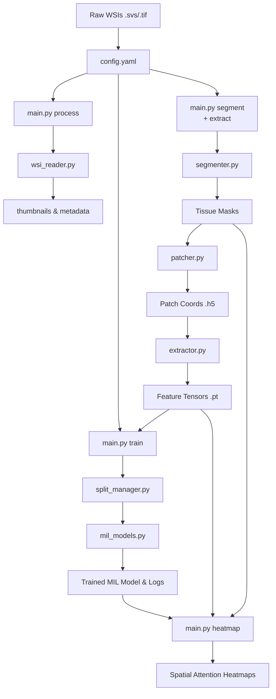

# WSI Framework Architecture Design

The new framework is designed to be modular, experiment-friendly, and configurable via YAML.

## 1. Project Directory Structure
```text
wsi_framework/
├── config/                 # YAML configuration files
│   └── config.yaml         # Main pipeline configuration execution
├── core/                   # Core pipeline modules
│   ├── __init__.py
│   ├── wsi_reader.py       # Reads WSI, extracts metadata, thumbnails
│   ├── segmenter.py        # Tissue segmentation (Otsu, HSV, adaptive)
│   ├── patcher.py          # Patch coordinate extraction from segments
│   └── extractor.py        # Feature extraction (CNNs/Foundation Models)
├── datasets/               # Dataset handling
│   ├── __init__.py
│   ├── slide_dataset.py    # PyTorch Native WSI Dataset mapping H5 coords
│   └── split_manager.py    # Cross-validation and split generation
├── models/                 # Deep learning models
│   ├── __init__.py
│   ├── feature_models.py   # Factory wrapping RN50, UNI, Virchow, Hibou, etc.
│   └── mil_models.py       # ABMIL, CLAM, TransMIL, etc.
├── pipelines/              # Orchestration scripts for CLI commands
│   ├── __init__.py
│   ├── preprocess.py       # Thumbnails, Metadata, Segmentation, Patching
│   ├── debug.py            # Debugging utilities for segmentation validation
│   ├── extract.py          # GPU Loop orchestrating feature extraction to .pt
│   ├── train.py            # Model training and validation loops
│   ├── evaluate.py         # Evaluation and metrics
│   └── visualize.py        # Heatmap reconstruction
├── utils/                  # Helper utilities
│   ├── __init__.py
│   ├── config.py           # YAML parsing and directory initialization
│   ├── transforms.py       # Dynamic torchvision.transforms pipeline builder
│   └── metrics.py          # AUC, F1, Accuracy tracking
├── docs/                   # Documentation
│   ├── setup_and_usage.md
│   └── architecture.md     # This file
├── main.py                 # Unified Command-Line Interface (CLI)
└── requirements.txt        # Python dependencies
```

## 2. Module Responsibilities
- **`core.wsi_reader`**: High-level interface to `OpenSlide`. Handles multi-resolution pyramidal reading, bounds checking, and thumbnail extraction.
- **`core.segmenter`**: Generates tissue masks using configurable thresholding (e.g., HSV masking + Median Blur + Otsu). Responsible for morphological operations (hole filling, cleaning).
- **`core.patcher`**: Uses tissue contours to generate non-overlapping or overlapping patch coordinates at a specified magnification level. Saves coordinates efficiently (e.g., to `.h5`).
- **`core.extractor`**: PyTorch-based inference script. Loads coordinates, fetches image patches dynamically, normalizes them, and passes them through a frozen backbone to save feature vectors as `.pt` tensors.
- **`datasets.split_manager`**: Handles patient-level stratified k-fold cross-validation creation to prevent data leakage between train/val/test.
- **`models.mil_models`**: Implementation of pooling functions (Mean, Max) and attention-based multiple instance learning networks.
- **`pipelines.*`**: Ties together core components to execute high-level tasks. E.g., `preprocess.py` sequences `wsi_reader -> segmenter -> patcher`.

## 3. Pipeline Workflow Diagram



## 4. CLI Command Design
The framework is accessed through a single entrypoint: `main.py <command> --config <path_to_yaml>`

| Command | Description |
| :--- | :--- |
| `python main.py process` | Extracts thumbnails and global slide metadata. |
| `python main.py segment` | Performs tissue segmentation and saves masks. |
| `python main.py patch` | Finds patch coordinates inside tissue and saves to `.h5`. |
| `python main.py extract` | Extracts patch features using `.h5` coords and a deep learning model. |
| `python main.py split` | Generates train/validation/test splits based on clinical data. |
| `python main.py train` | Trains a MIL network on extracted features. |
| `python main.py evaluate`| Evaluates models and plots ROC curves. |
| `python main.py heatmap` | Projects model attention scores back onto WSI thumbnails. |

## 5. Experiment Tracking Structure
All outputs are dynamically routed to a `results_dir` specified in `config.yaml`.
Inside `results/`, tasks are structurally separated to prevent overriding and to cache intermediate forms.

```text
results/
├── thumbnails/             # Global slide views
├── metadata/               # Level dimensions and physical spacing
├── segmentation/           # Binary masks of tissue
├── patches/                # Coordinates of patches (.h5)
├── features/               # Extracted deep features (.pt)
│   ├── resnet50/
│   └── uni/
├── splits/                 # K-fold splits (.csv)
├── logs/                   # Tensorboard or CSV logs
│   ├── exp_001_clam_sb_resnet50/
│   │   ├── events.out.tfevents...
│   │   └── training_stats.txt
├── models/                 # Saved PyTorch checkpoints (.pth)
│   └── exp_001_clam_sb_resnet50/
│       ├── best_model.pth
│       └── final_model.pth
└── heatmaps/               # Interpretable spatial visualizations
    └── exp_001_clam_sb_resnet50/
        ├── slide_1_heatmap.png
        └── slide_2_heatmap.png
```

This tracking structure allows a researcher to swap out one configuration (e.g., `feature_extractor: uni`) without deleting the old `resnet50` features or models, ensuring efficient re-runs.
